# [Investigating Windows](https://tryhackme.com/r/room/investigatingwindows) 

This repository is dedicated to show how i go through Hacking challenges.
Created only for learning pourposes and all the solutions and tricks are used at controlled environments.
Happy Hacking 😃

A windows machine has been hacked, its your job to go investigate this windows machine and find clues to what the hacker might have done.

Connect to the machine using RDP. The credentials the machine are as follows:

###### Username: Administrator

###### Password: letmein123!

#### So let's get started phreaks 🕵️‍♂️

* If you're going to connect to the Windows machine remotely, don't forget to setup your VPN config file and make shure your connection is running, good? 👍
  
* First of all, i'll be connecting to the remote windows machine using RDP, but you can just start the Windows machine at [Try Hack Me](https://tryhackme.com/r/room/investigatingwindows) by clicking the green "Start Machine" button 💡


#### I'm at a Kali Linux Machine, so the command is ⬇️
  
````
xfreerdp /v:<victim_machine_ip> /u:Administrator /p:letmein123!
````

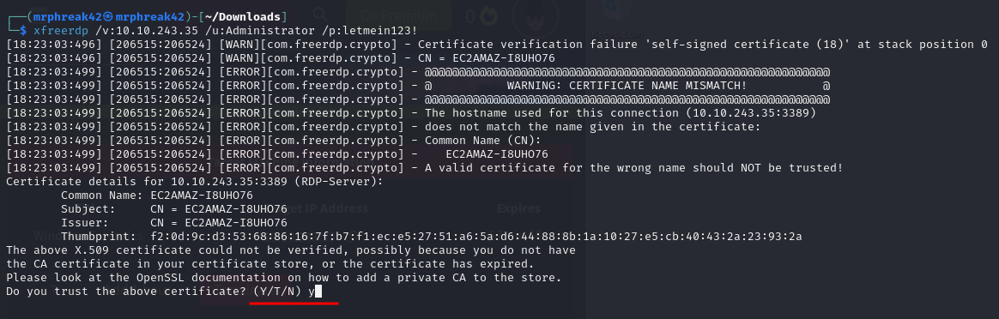
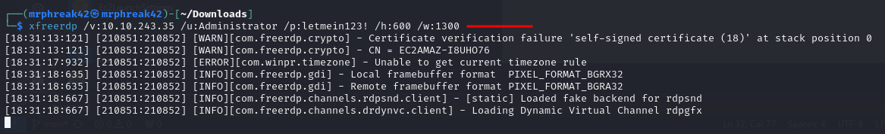

* You'll be asked if you wanna trust the certificate, make shure you type "y" and click enter 👍
* There's also a width and height option that you can pass if you want.

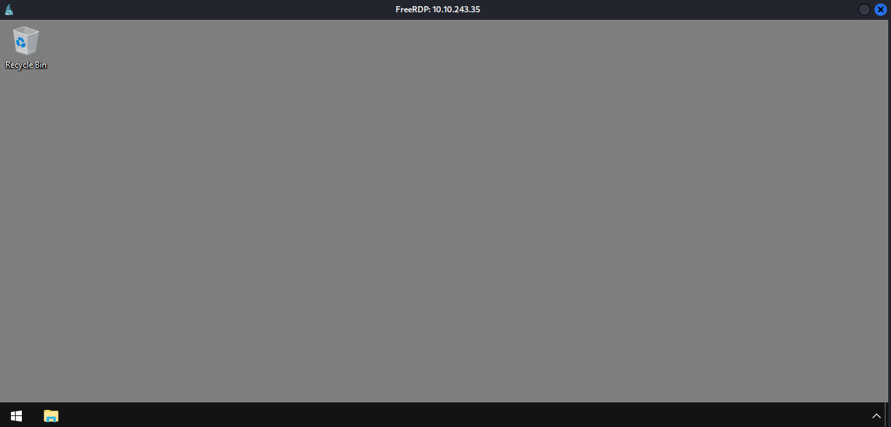


### Questions

1. ### Whats the version and year of the windows machine?
    
    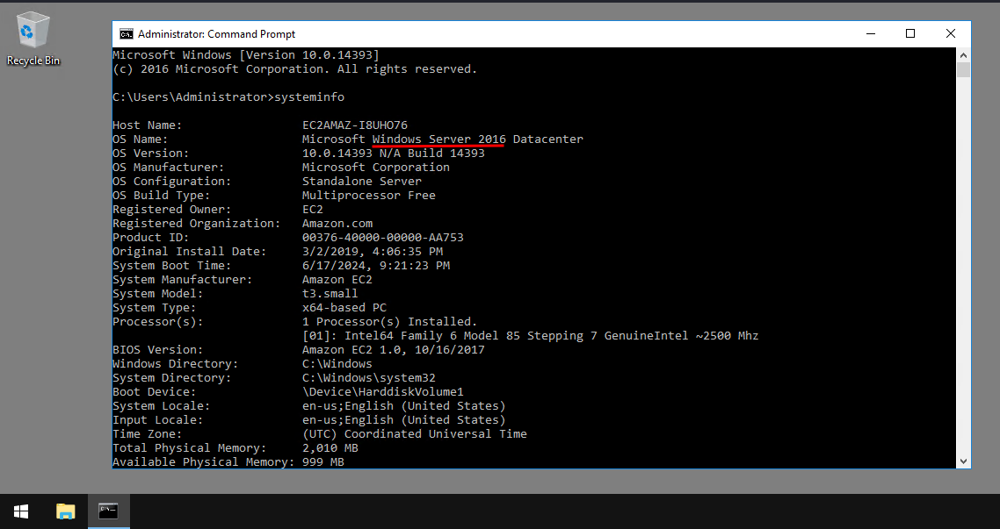

    ### And there is the answer:

    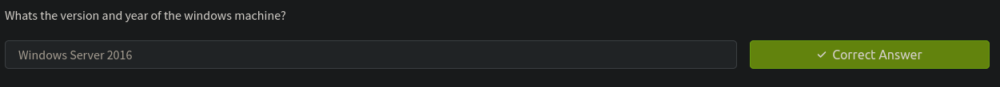

    * First one is easy, just type "systeminfo" and it gives to you all computer's basic information.


2. ### Which user logged in last?
    
    * For this one first we need to know how many users are in the victim's machine.
    * The command for this is the following:
  
        ````
        net user
        ````
    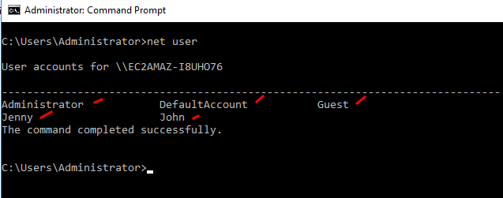

    * Now you know all of them!
    * And it takes us to the next command to see who logged in before us.
    * There's many ways you can do this specially in Windows machines, navigating by the interface.
    * But, we are hackers, we should really know how to manage different commands into any terminal.
    * The command below, shows the login of the "administrator" user  ⬇️
    ````
    net user "administrator" | findstr /B /C:"Last logon"  
    ````
    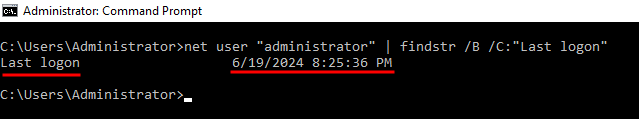

    * But, just like i said, we're hackers, we want something more.
    * So let's create a script to return all users last logins into our terminal:
    
    ````
    @echo off

    for %%u in (John Administrator Jenny Guest DefaultAccount) do (
        echo %%u:
        net user %%u | findstr /B /C:"Last logon"
        echo.
    )

    ````
    * First we need to know where we are, do let's run a dir:
    
    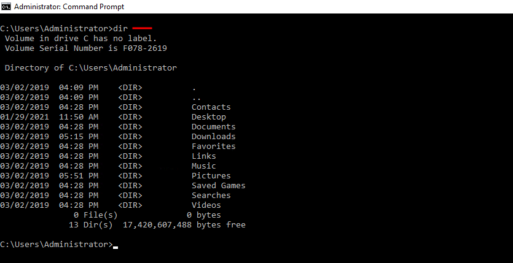

    * You can change directories if you want, but i'm kipping this one.
    * Now lets create the file :
    ````
    echo "hello" > check_logon.bat
    ````
    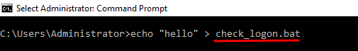

    * Now you can open notepad and start creating your script:
    ````
    notepad check_logon.bat
    ````
    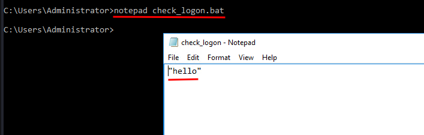
    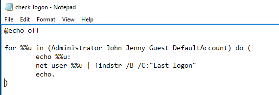

    * Save the file.
    * Now go back to the terminal and run the file:
  
    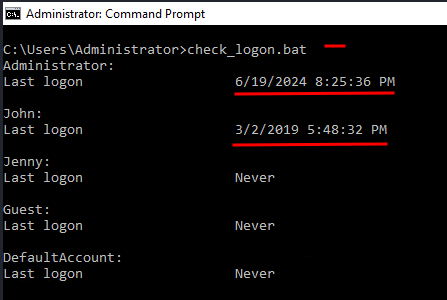


    ### And there is the answer:

    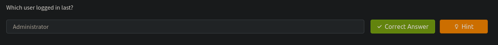


3. ### When did John log onto the system last?
   
   * The answer for this one is in the last answer:

    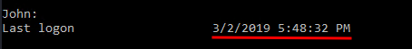


    ### And there is the answer:

    
    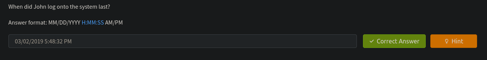
  

4. ### What IP does the system connect to when it first starts?
   
   * For this you need to watch when the you start the machine, there will be an ip showing up to the screen.

    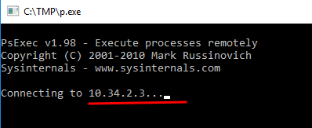


    ### And there is the answer:


    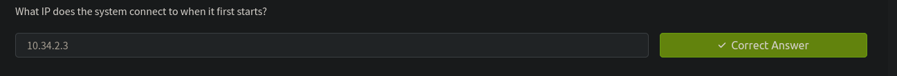

5. ### What two accounts had administrative privileges (other than the Administrator user)?
   
   * First thing about this you need to know is .... users belongs to groups.
   * So, if i'm logged in as Administrator, i can see what groups are there and which one i'm part of.
   * And that's an easy task:
  
    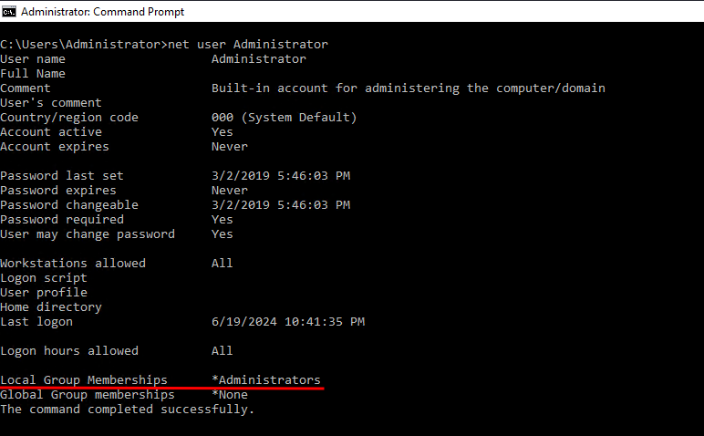
  
   * And now it's easy to find who has the same level of access that you have:
  
    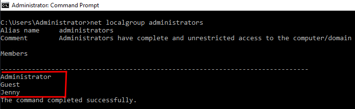


    ### And there is the answer:
    
    
   
6. ### Whats the name of the scheduled task that is malicous?

   * Windows machines have a "Task Scheduler"
   * And we're taking a look at this tasks
   * For this you can click at "Windows" key or icon and type "task scheduler"
   * It'll show you something like this
  
    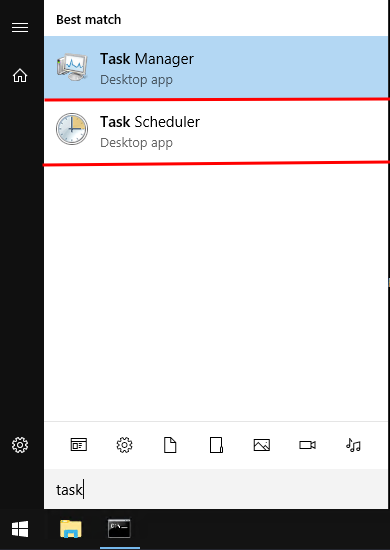
    
   * You click in "Task Scheduler" and you'll be directed to the scheduler screen
   * Take your time and look to all the files there
   * Certanly you'll reach the same result as mine
   * There is a file called "Clean file system"
   * It runs every day at 4:55 PM 

    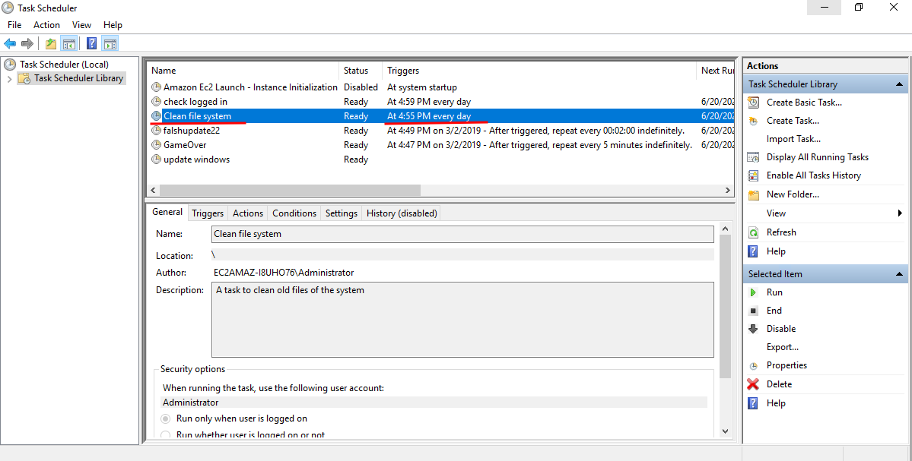

   * And now we can take a good look at the "Actions" tab 
    
    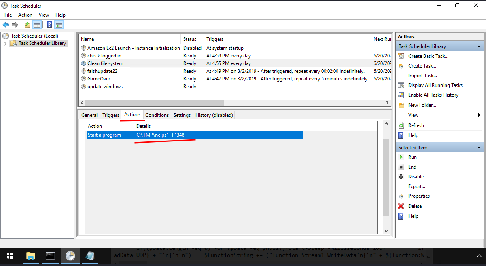

   * As you can see, this file runs a PowerShell task
   * And to have the full knowledge about whats going on with that file
   * Let's take a closer look
   * So we navigate to that path where the ".ps1" file is located
   
    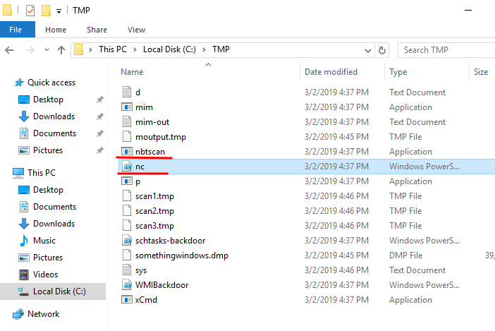
   
   * I chose to open it with "Notepad" to see what it does

    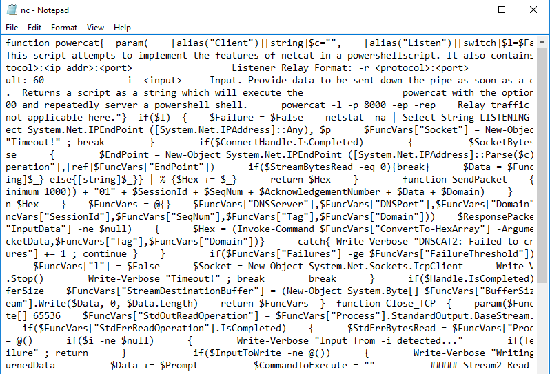

   
   * And there it is ... a malicious code that involves running a Python script that listens for a connection and, upon receiving a connection, executes commands on the connecting machine. This behavior is characteristic of a reverse shell, a type of shell where the target machine initiates the connection to the attacker's machine, allowing the attacker to execute commands on the target machine remotely.
  

    ### And there is the answer:

    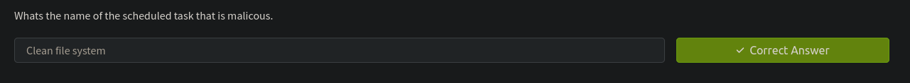

    

7. ### What file was the task trying to run daily?

    This is answered in the last question:

    
    


    ````
    nc.ps1
    ````

    ### And there is the answer:
    
    


8. ### What port did this file listen locally for?

    This is in the question number 06 too.
    If you double click at the malicious task, the screen below opens to you:

    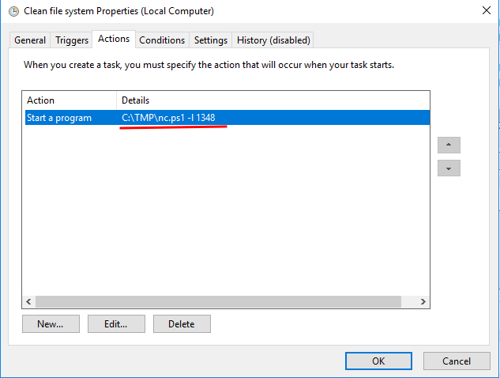

    Take a look at the command:

    ````
    C:\TMP\nc.ps1 -l 1348
    ````

    What it does is execute the file >>> C:\TMP\nc.ps1

    Then tells it to listen to some port >>> -l

    And finally the port that will receive some interaction >>> 1348


    ### And there is the answer:
    
    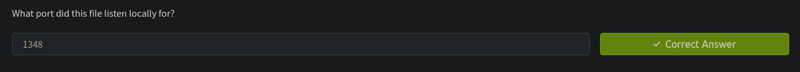


9. ### When did Jenny last logon?

    This is aswered at the question 02.

    Do you remember we built a script to show us all the last logged in users?

    Take a look at the output for Jenny:

    


    ### And there is the answer:

    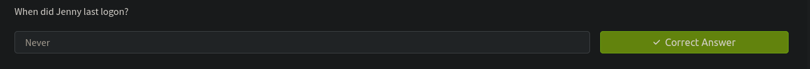


10. ### At what date did the compromise take place?
    
    For this one you can take a look at the "TMP" directory, because there are many malicious codes as we already know, and at the same date, other directories also have changes.

    
    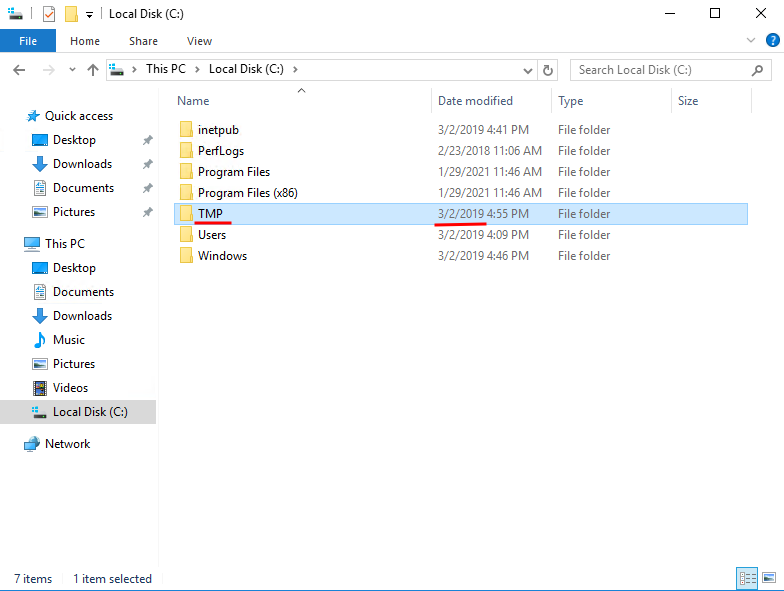

    
    ### And there is the answer:
    
    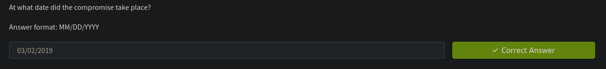


11. ### At what date did the compromise take place?

    #### THIS QUESTION IS A BIT WEIRD. BECAUSE THE CORRECT ANSWER SHOULD BE THE EVENT CODE 4670
    #### BUT FOR SOME REASON IT'S NOT. SO LET'S TAKE THE HINT GIVEN AT TRY HACK ME E MOVE ON.
    
    For this one you need to take a look at "Event Viewer".

    Windows machines storage their events there and you can take advantage of it.

    So... you can press windows key and type "event" and this will show up:


    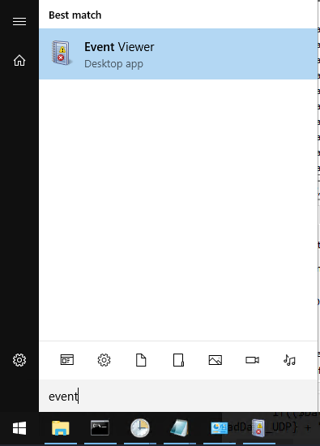


    Now you see this screen with events, that happened in this machine, and there are logs, and logs tells you a story. Let's take a closer look at it:

    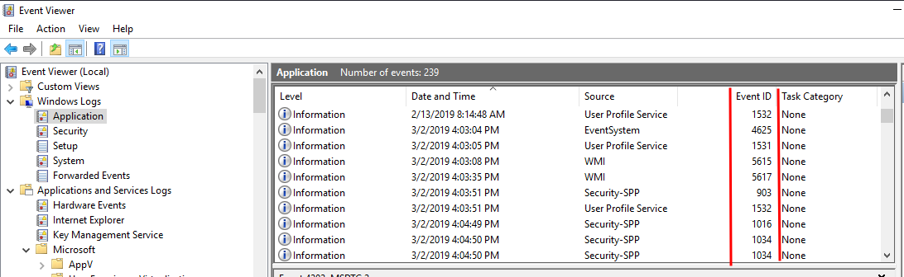


    And now, you can search and read more about "Event ID" in Windows machines.

    This knowledge gives you information without need to search log by log whats going on.

    
    ### And there is the answer:

    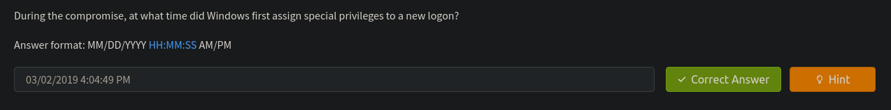


12. ### What tool was used to get Windows passwords?

    As we know, there's a "TMP" directory with malicious files.


    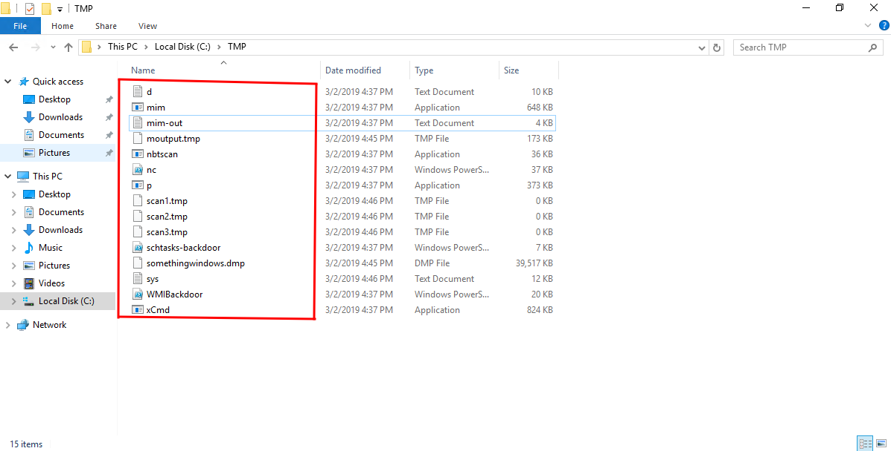


    And after you look inside all of them, there is one file with a evil script well know by the hacking community called: Mimikatz.

    If you don't know what Mimikatz is... basically Benjamin Delpy created it as a proof of concept to show Microsoft that its authentication protocols were vulnerable to attack.


    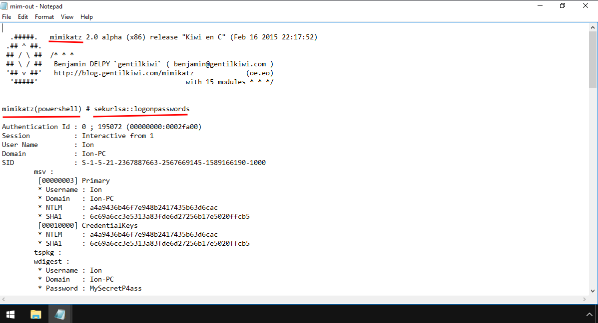
    
    ### And there is the answer:
    
    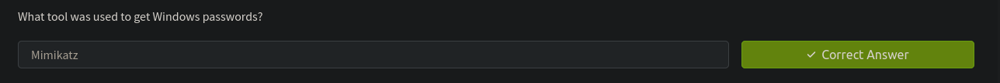


13. ### What was the attackers external control and command servers IP?

    Well, Windows machines have hosts file. If didn't know about it, now you do.

    The hosts file is a plain text file used to map host names to IP addresses. On Windows, it is located in the C:\Windows\System32\drivers\etc folder. 


    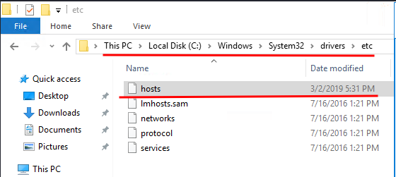


    Inside hosts you'll find this:


    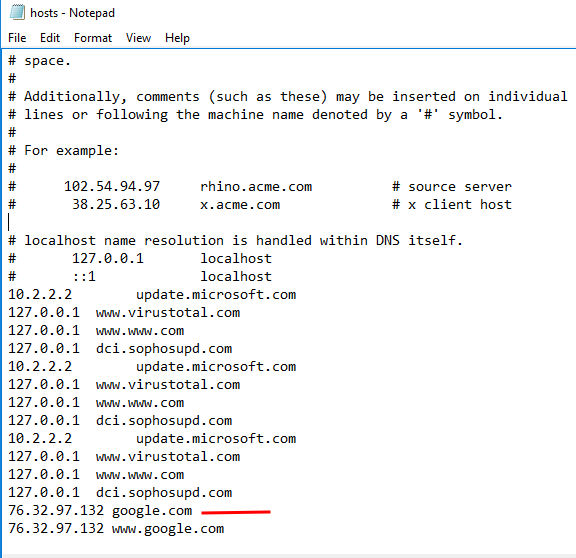


    ### And there is the answer:
    
    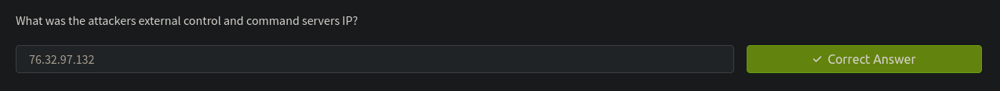


14. ### What was the extension name of the shell uploaded via the servers website?

    This is the type of question that know the answer if you are curious about everything and have searched for all the victim's file system.

    Because the answer for this one is right in front of our faces.

    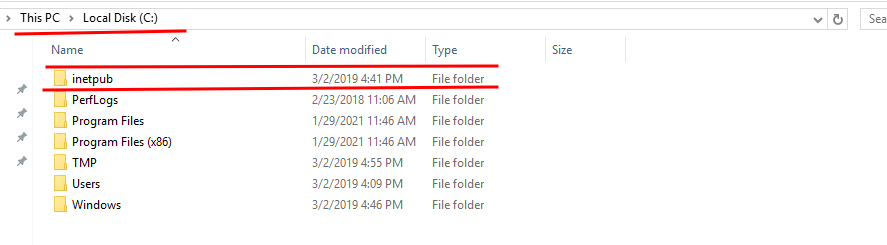

    When you navigate into this folder, there is another called "wwwroot"

    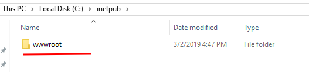

    You enter this one too, and there are some interesting files.

    Take your time... take a alook around. 

    There's our answer. 

    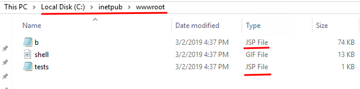


    ### And there is the answer:

    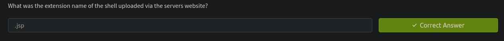


15. ### What was the last port the attacker opened?

    Think with me now. 

    You have a house. Inside there is everything you need... food, clothes, bed, etc...

    There's a lot of things you care about, so you protect it! Right?

    So, we live in a world even more digitalized every single day.

    People care even more about their phones and computers then  other people.

    So... WHAT IS THE MOST KNOWN WAY TO PROTECT YOUR COMPUTER?

    Exactly, Firewall!!!!

    So, let's take a look. Press Windows key and type "firewall"

    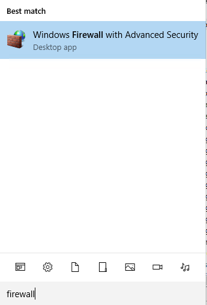

    Now, we have a feel options, the first one is obviously..."Inbound Rules".

    Click there, what is the last rule changed to the PC?

    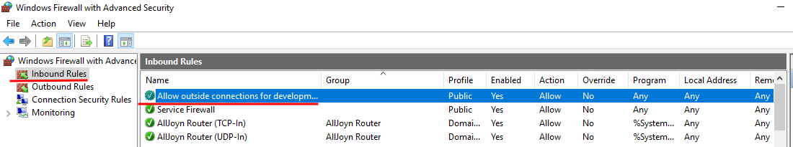

    Now, scroll to side a bit

    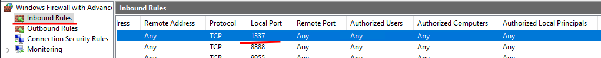

    ### And there is the answer:

    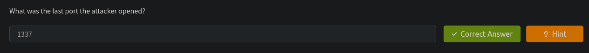


16. ### Check for DNS poisoning, what site was targeted?

    The last one is already answered.

    Let's go back to the "Network Basics".

    As you know, DNS exists for translating human-readable domain names into IP addresses that computers use to identify each other on the network. Right?

    So, by tampering with the DNS data, attackers can redirect traffic from legitimate websites to fraudulent or malicious ones. 

    And.... where is the file that has hostnames and ip addresses in our Windows machine? 

    Exactly >>>> C:\Windows\System32\drivers\etc

    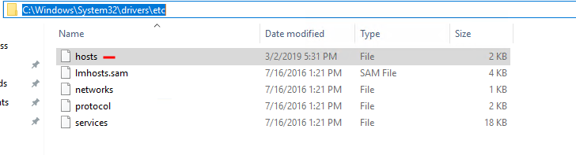

    Do you remember what was the ip used to remotely control the victim's machine? Check question 13.

    


    ### And there is the answer:

    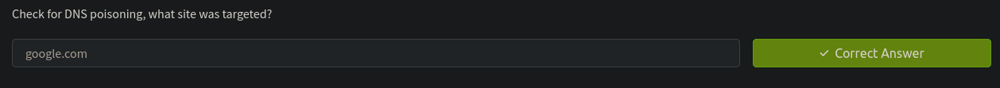


